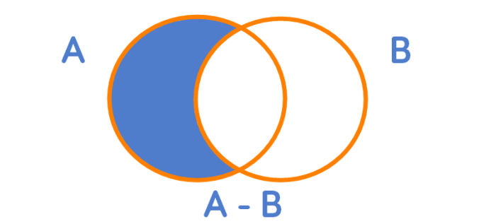

http://www.aaronschlegel.com/algebra-of-sets/

Part 4 of 5 in the series Set Theory

1. Introduction to Set Theory and Sets with R

2. Set Operations Unions and Intersections in R

3. Set Theory Arbitrary Union and Intersection Operations with R

4. Algebra of Sets in R

5. Set Theory Ordered Pairs and Cartesian Product with R

The set operations, union and intersection, the relative complement - and the inclusion relation (subsets) $\subseteq$ are known as the algebra of sets. The algebra of sets can be used to find many identities related to set relations that will be discussed later. We turn now to introducing the relative complement.

## Relative Complement

The relative complement of two sets **A** and **B** is defined as the members of **A** not in **B** and is denoted **A** - **B** (or **A**/**B**). More formally, the relative complement of two sets is defined as:

**A** - **B** = {x $\in$ **A** | x $\notin$ **B**}

Just like the set operations union and intersection, the relative complement can be visualized using Venn diagrams.



The shaded area represents the relative complement **A** - **B**.

For example, consider the following three sets **A**, **B**, **C**:

- Let **A** be the set of all Calico cats

- Let **B** be the set of all Manx cats

- Let **C** be the set of all male cats

What are the elements of the set **A** $\cup$ (**B** - **C**)? Start with the relative complement in parentheses, which is the set of all nonmale Manx cats. It wouldn't be as correct to state **B** - **C** is the set of all female Manx cats as it hasn't been explicitly defined that the cats not in the set **C** are female. Then the union of **A** and this set is, therefore, the set of all cats who are either Calico or Manx nonmales (or both).

Determining the elements of the set (**A** $\cup$ **B**) - **C** proceeds in the same way. The union of **A** and **B** represents the set of all cats who are Calico or Manx or both. Thus the relative complement of this set CC is then the set of all nonmale cats who are either or both Calico or Manx.

The set (**A** - **C**) $\cup$ (**B** - **C**) simplifies to one of the sets discussed above. The relative complement **A** - **C** is the set of all nonmale Calico cats while **B** - **C** is the set of all nonmale Manx cats. The union of these two sets thus results in the set of all nonmale cats who are either Calico or Manx, which is the same as the set (**A** $\cup$ **B**) - **C**.

We can define an R function to find the relative complement of two sets.

```{r, comment=NA}
relcomp <- function(a, b) {
  comp <- vector()

  for(i in a) {
    if(i %in% a && !(i %in% b)) {
      comp <- append(comp, i)
    }
  }

  return(comp)
}

my.relcomp <- function(a, b) {
  return(a[!a %in% b])
}
```

Find the relative complements of the sets 

**A** = {1, 2, 3, 4, 5} 

and 

**B** = {1, 3, 5, 7}

```{r, comment=NA}
a <- c(1, 2, 3, 4, 5)
b <- c(1, 3, 5, 7)

relcomp(a, b)
relcomp(b, a)

# my version
my.relcomp(a, b)
my.relcomp(b, a)

# base R version
setdiff(a, b)
setdiff(b, a)
```

## Set Identities

Many identities can be formed using the set operations we have explored.

### Commutative Laws

**A** $\cup$ **B** = **B** $\cup$ **A**

**A** $\cap$ **B** = **B** $\cap$ **A**

We can show this identity using the isequalset() and set.union() functions we created in the previous post on union and intersections.

```{r, comment=NA}
a <- c(1, 2, 3, 4, 5)
b <- c(1, 3, 5, 7)

#isequalset(set.union(a, b), set.union(b, a))
#isequalset(set.intersection(a, b), set.intersection(b, a))

setequal(union(a, b), union(b, a))
setequal(intersect(a, b), intersect(b, a))
```

### Associative Laws

**A** $\cup$ (**B** $\cup$ **C**) = (**A** $\cup$ **B**) $\cup$ **C**

**A** $\cap$ (**B** $\cap$ **C**) = (**A** $\cap$ **B**) $\cap$ **C**

Create a third set cc.

```{r, comment=NA}
c <- c(2, 3, 4, 6)
```

Starting with the first associative law,

**A** $\cup$ (**B** $\cup$ **C**) = (**A** $\cup$ **B**) $\cup$ **C**

```{r, comment=NA}
#assoc.rhs <- set.union(a, set.union(b, c)) # Right-hand Side
#assoc.lhs <- set.union(set.union(a, b), c) # Left-hand Side

assoc.rhs <- union(a, union(b, c)) # Right-hand Side
assoc.lhs <- union(union(a, b), c) # Left-hand Side

rbind(assoc.rhs, assoc.lhs)
```

Showing the second associative law, 

**A** $\cap$ (**B** $\cap$ **C**) = (**A** $\cap$ **B**) $\cap$ **C**

```{r, comment=NA}
#assoc2.rhs <- set.intersection(a, set.intersection(b, c))
#assoc2.lhs <- set.intersection(set.intersection(a, b), c)

assoc2.rhs <- intersect(a, intersect(b, c))
assoc2.lhs <- intersect(intersect(a, b), c)

rbind(assoc2.rhs, assoc2.lhs)
```

### Distributive Laws

**A** $\cap$ (**B** $\cup$ **C**) = (**A** $\cap$ **B**) $\cup$ (**A** $\cap$ **C**)

**A** $\cup$ (**B** $\cap$ **C**) = (**A** $\cup$ **B**) $\cap$ (**A** $\cup$ **C**)

starting with the first distributive law, 

**A** $\cap$ (**B** $\cup$ **C**) = (**A** $\cap$ **B**) $\cup$ (**A** $\cap$ **C**)

```{r, comment=NA}
#dist.rhs <- set.intersection(a, set.union(b, c))
#dist.lhs <- set.union(set.intersection(a, b), set.intersection(a, c))

dist.rhs <- intersect(a, union(b, c))
dist.lhs <- union(intersect(a, b), intersect(a, c))

rbind(dist.rhs, dist.lhs)
```

Which are equal sets as member order does not matter when determining the equality of two sets. The second distributive law, 

**A** $\cup$ (**B** $\cap$ **C**) = (**A** $\cup$ **B**) $\cap$ (**A** $\cup$ **C**)

can be demonstrated likewise.

```{r, comment=NA}
#dist2.rhs <- set.union(a, set.intersection(b, c))
#dist2.lhs <- set.intersection(set.union(a, b), set.union(a, c))

dist2.rhs <- union(a, intersect(b, c))
dist2.lhs <- intersect(union(a, b), union(a, c))

rbind(dist2.rhs, dist2.lhs)
```

### De Morgan's Laws

**C** - (**A** $\cup$ **B**) = (**C** - **A**) $\cap$ (**C** - **B**)

**C** - (**A** $\cap$ **B**) = (**C** - **A**) $\cup$ (**C** - **B**)

We can use the function to find the relative complement of two sets we wrote earlier to show De Morgan's laws. Starting with the first law, 

**C** - (**A** $\cup$ **B**) = (**C** - **A**) $\cap$ (**C** - **B**)

```{r, comment=NA}
#morgan.rhs <- relcomp(c, set.union(a, b))
#morgan.lhs <- set.intersection(relcomp(c, a), relcomp(c, b))

morgan.rhs <- setdiff(c, union(a, b))
morgan.lhs <- intersect(setdiff(c, a), setdiff(c, b))

rbind(morgan.rhs, morgan.lhs)
```

The second De Morgan's law, 

**C** - (**A** $\cap$ **B**) = (**C** - **A**) $\cup$ (**C** - **B**)

can be shown similarly.

```{r, comment=NA}
#morgan2.rhs <- relcomp(c, set.intersection(a, b))
#morgan2.lhs <- set.union(relcomp(c, a), relcomp(c, b))

morgan2.rhs <- setdiff(c, intersect(a, b))
morgan2.lhs <- union(setdiff(c, a), setdiff(c, b))

rbind(morgan2.rhs, morgan2.lhs)
```

De Morgan's laws are often stated without **C**, being understood as a fixed set. All sets are a subset of some larger set, which can be called a 'space,' or **S**. If one considers the space to be the set of all real numbers **R**, and **A** and **B** to be two subsets of **S**(**R**), then De Morgan's laws can be abbreviated as:

\-(**A** $\cup$ **B**) = -**A** $\cap$ -**B** 

\-(**A** $\cap$ **B**) = -**A** $\cup$ -**B**

We will close the post by stating some identities with the assumption **A** $\subseteq$ **S**

**A** $\cup$ **S** = **S** 

**A** $\cap$ **S** = **A** 

**A** $\cup$ -**A** = **S** 

**A** $\cap$ -**A** = $\varnothing$ 

Though we cannot directly program the set of all real numbers **R** as it is an uncountable set, we can show these identities by using a subset of **R** where a set **A** is a subset of that subset.

Generate the set **A** as the set of integers from one to ten and **S**, our simulated set of all real numbers, as the set of integers from one to 100.

```{r, comment=NA}
a <- seq.int(10)
s <- seq.int(100)
```

Show the first identity: 

**A** $\cup$ **S** = **S**

```{r, comment=NA}
#isequalset(set.union(a, s), s)
setequal(union(a, s), s)
```

Second identity: 

**A** $\cap$ **S** = **A**

```{r, comment=NA}
#isequalset(set.intersection(a, s), a)
setequal(intersect(a, s), a)
```

Third identity: 

**A** $\cup$ -**A** = **S**

```{r, comment=NA}
#isequalset(set.union(a, relcomp(s, a)), s)
setequal(union(a, setdiff(s, a)), s)
```

Fourth identity: 

**A** $\cap$ -**A** = $\varnothing$

```{r, comment=NA}
#set.intersection(a, relcomp(s, a))
intersect(a, setdiff(s, a))
```

## References

Enderton, H. (1977). *Elements of Set Theory* (1st ed.). New York: Academic Press.
