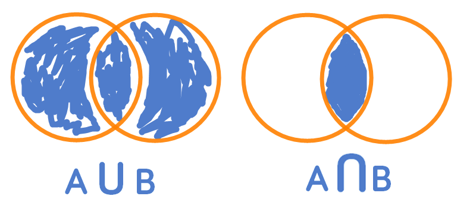

http://www.aaronschlegel.com/set-operations-unions-intersections-r/

Part 2 of 5 in the series Set Theory

1. Introduction to Set Theory and Sets with R

2. Set Operations Unions and Intersections in R

3. Set Theory Arbitrary Union and Intersection Operations with R

4. Algebra of Sets in R

5. Set Theory Ordered Pairs and Cartesian Product with R

The set operations of unions and intersections should ring a bell for those who've worked with relational databases and Venn Diagrams. The 'union' of two of sets A and B represents a set that comprises all members of A and B (or both).

One of the most natural ways to visualize set unions and intersections is using Venn diagrams.



The Venn diagram on the left visualizes a set union while the Venn diagram on the right visually represents a set intersection operation.

## Set Unions

The union of two sets AA and BB is denoted as:

A $\cup$ B

The union axiom states for two sets A and B, there is a set whose members consist entirely of those belonging to sets A or B, or both. More formally, the union axiom is stated as:

$\forall$ a $\forall$ b $\exists$ B $\forall$ x (x $\in$ B $\Leftrightarrow$ x $\in$ a $\vee$ x $\in$ b)

For example, for two sets A and B:

A = {3, 5, 7, 11}

B = {3, 5, 13, 17} 

The union of the two sets is:

A $\cup$ B = {3, 5, 7, 11} $\cup$ {3, 5, 13, 17} = {3, 5, 7, 11, 13, 17}

Update: Andrey in the comment section posted much more efficient and cleaner versions of the set union, intersection and subset functions below.

We can define a simple function in R that implements the set union operation. There is a function in base R union() that performs the same operation that is recommended for practical uses.

```{r, comment=NA}
set.union <- function(a, b) {
  u <- a
  for(i in 1:length(b)) {
    if(!(b[i] %in% u)) {
      u <- append(u, b[i])
    }
  }
  return(u)
}

my.set.union <- function(a, b) {
  u <- c(a, b)
  u <- unique(u)
  return(sort(u))
}
```

Using our function to perform a union operation of the two sets as above.

```{r, comment=NA}
a <- c(3, 5, 7, 11)
b <- c(3, 5, 13, 17)

set.union(a, b)

# my version
my.set.union(a, b)

# base R version
union(a, b)
```

## Set Intersections

The intersection of two sets A and B is the set that comprises the elements that are both members of the two sets. Set intersection is denoted as:

A $\cap$ B

Interestingly, there is no axiom of intersection unlike for set union operations. The concept of set intersection arises from a different axiom, the axiom schema of specification, which asserts the existence of a subset of a set given a certain condition. Defining this condition (also known as a sentence) as $\sigma$(x), the axiom of specification (subset) is stated as:

$\forall$ A $\exists$ B $\forall$ x (x $\in$ B $\Leftrightarrow$ x $\in$ A $\wedge$ $\sigma$(x))

Put another way; the axiom states that for a set A and a condition (sentence) $\sigma$ of a subset of A, the subset does indeed exist. This axiom leads us to the definition of set intersections without needing to state any additional axioms. Using the subset axiom as a basis, we can define the existence of the set intersection operation. Given two sets *a* and *b*:

$\forall$ a $\forall$ b $\exists$ B $\forall$ x (x $\in$ B $\Leftrightarrow$ x $\in$ a $\wedge$ x $\in$ b)

Stated plainly, given sets *a* and *b*, there exists a set B that contains the members existing in both sets.

For example, using the previous sets defined earlier:

A = {3, 5, 7, 11}

B = {3, 5, 13, 17}

The intersection of the two sets is:

A $\cap$ B = {3, 5, 7, 11} $\cap$ {3, 5, 13, 17} = {3, 5}

We can also define a straightforward function to implement the set intersection operation. Base R also features a function intersect() that performs the set intersection operation.

```{r, comment=NA}
set.intersection <- function(a, b) {
  intersect <- vector()

  for(i in 1:length(a)) {
    if(a[i] %in% b) {
      intersect <- append(intersect, a[i])
    }
  }
  return(intersect)
}

my.set.intersection <- function(a, b) {
  u <- unique(c(a, b))
  i <- u[u %in% a & u %in% b]

  return(sort(i))
}
```

Then using the function to perform set intersection on the two sets to confirm our above results.

```{r, comment=NA}
a <- c(3, 5, 7, 11, 13, 20, 30)
b <- c(3, 5, 13, 17, 7, 10)

set.intersection(a, b)

# my version
my.set.intersection(a, b)

# base R version
intersect(a, b)
```

## Subsets

The concept of a subset of a set was introduced when we developed the set intersection operation. A set, A, is said to be a subset of B, written as A $\subset$ B if all the elements of A are also elements of B. Therefore, all sets are subsets of themselves and the empty set $\varnothing$ is a subset of every set.

We can write a simple function to test whether a set *a* is a subset of *b*.

```{r, comment=NA}
issubset <- function(a, b) {
  for(i in 1:length(a)) {
    if(!(a[i] %in% b)) {
      return(FALSE)
    }
  }
  return(TRUE)
}

my.issubset <- function(a, b) {
  s <- a %in% b
  return(all(s))
}
```

The union of two sets aa and bb has by definition subsets equal to aa and bb, making a good test case for our function.

```{r, comment=NA}
a <- c(3, 5, 7, 11)
b <- c(3, 5, 13, 17)

c <- set.union(a, b)
c

issubset(a, c)
issubset(b, c)
issubset(c(3, 5, 7, 4), a)

# my version
my.issubset(a, c)
my.issubset(b, c)
my.issubset(c(3, 5, 7, 4), a)

# base R version
all(is.element(a, c))
all(is.element(b, c))
all(is.element(c(3, 5, 7, 4), a))
```

## Summary

This post introduced the common set operations unions and intersections and the axioms asserting those operations, as well as the definition of a subset of a set which arises naturally from the results of unions and intersections.

## References

Axiom schema of specification. (2017, May 27). In Wikipedia, The Free Encyclopedia. From https://en.wikipedia.org/w/index.php?title=Axiom_schema_of_specification&oldid=782595557

Axiom of union. (2017, May 27). In Wikipedia, The Free Encyclopedia. From https://en.wikipedia.org/w/index.php?title=Axiom_of_union&oldid=782595523

Enderton, H. (1977). *Elements of set theory* (1st ed.). New York: Academic Press.